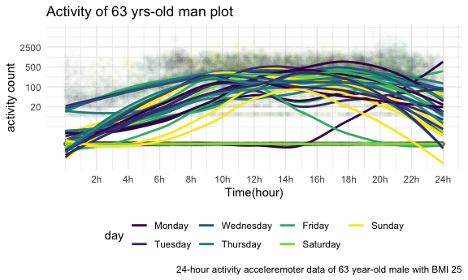
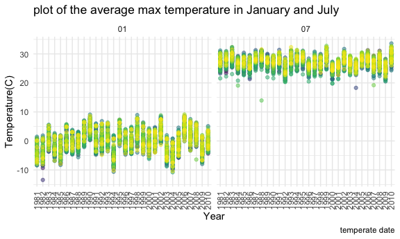
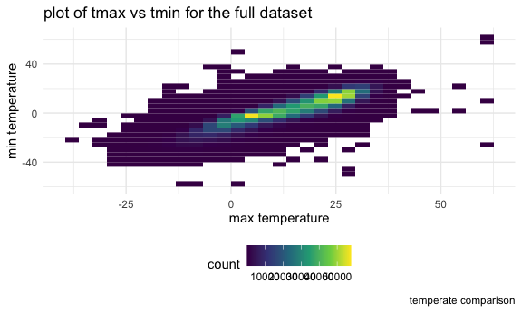
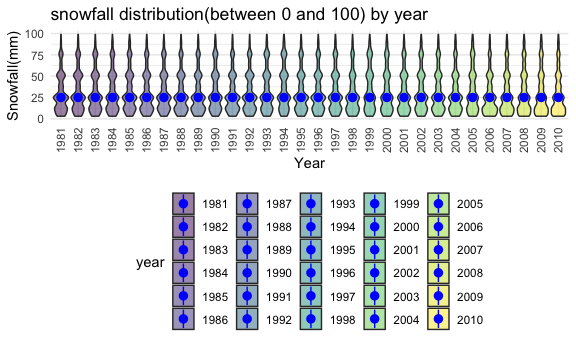
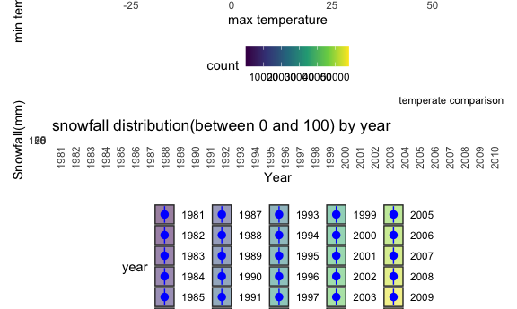

p8105\_hw3\_xw2758
================
Xinyi Wang
10/10/2020

## Problem 1

``` r
data("instacart")
```

This dataset contains 1384617 rows and 15 columns.

Observations are the level of items in orders by user. There are user /
order variables – user ID, order ID, order day, and order hour. There
are also item variables – name, aisle, department, and some numeric
codes.

How many aisles, and which are most items from?

``` r
instacart %>% 
    count(aisle) %>% 
    arrange(desc(n))
```

    ## # A tibble: 134 x 2
    ##    aisle                              n
    ##    <chr>                          <int>
    ##  1 fresh vegetables              150609
    ##  2 fresh fruits                  150473
    ##  3 packaged vegetables fruits     78493
    ##  4 yogurt                         55240
    ##  5 packaged cheese                41699
    ##  6 water seltzer sparkling water  36617
    ##  7 milk                           32644
    ##  8 chips pretzels                 31269
    ##  9 soy lactosefree                26240
    ## 10 bread                          23635
    ## # … with 124 more rows

Let’s make a plot

``` r
instacart %>% 
    count(aisle) %>% 
    filter(n > 10000) %>% 
    mutate(
        aisle = factor(aisle),
        aisle = fct_reorder(aisle, n)
    ) %>% 
    ggplot(aes(x = aisle, y = n)) + 
    geom_point() + 
    theme(axis.text.x = element_text(angle = 90, vjust = 0.5, hjust = 1))
```


Let’s make a table\!\!

``` r
instacart %>% 
    filter(aisle %in% c("baking ingredients", "dog food care", "packaged vegetables fruits")) %>% 
    group_by(aisle) %>% 
    count(product_name) %>% 
    mutate(rank = min_rank(desc(n))) %>% 
    filter(rank < 4) %>% 
    arrange(aisle, rank) %>% 
    knitr::kable()
```

| aisle                      | product\_name                                 |    n | rank |
| :------------------------- | :-------------------------------------------- | ---: | ---: |
| baking ingredients         | Light Brown Sugar                             |  499 |    1 |
| baking ingredients         | Pure Baking Soda                              |  387 |    2 |
| baking ingredients         | Cane Sugar                                    |  336 |    3 |
| dog food care              | Snack Sticks Chicken & Rice Recipe Dog Treats |   30 |    1 |
| dog food care              | Organix Chicken & Brown Rice Recipe           |   28 |    2 |
| dog food care              | Small Dog Biscuits                            |   26 |    3 |
| packaged vegetables fruits | Organic Baby Spinach                          | 9784 |    1 |
| packaged vegetables fruits | Organic Raspberries                           | 5546 |    2 |
| packaged vegetables fruits | Organic Blueberries                           | 4966 |    3 |

Apples vs ice cream..

``` r
instacart %>% 
    filter(product_name %in% c("Pink Lady Apples", "Coffee Ice Cream")) %>% 
    group_by(product_name, order_dow) %>% 
    summarize(mean_hour = mean(order_hour_of_day)) %>% 
    pivot_wider(
        names_from = order_dow,
        values_from = mean_hour
    )
```

    ## `summarise()` regrouping output by 'product_name' (override with `.groups` argument)

    ## # A tibble: 2 x 8
    ## # Groups:   product_name [2]
    ##   product_name       `0`   `1`   `2`   `3`   `4`   `5`   `6`
    ##   <chr>            <dbl> <dbl> <dbl> <dbl> <dbl> <dbl> <dbl>
    ## 1 Coffee Ice Cream  13.8  14.3  15.4  15.3  15.2  12.3  13.8
    ## 2 Pink Lady Apples  13.4  11.4  11.7  14.2  11.6  12.8  11.9

## Problem 2

### Fisrt, I will load, tidy, and otherwise wrangle the data.

``` r
acc_df = acc_df = read_csv("~/R_columbia/p8105/p8105_hw3_xw2758/data/accel_data.csv") %>% 
 janitor::clean_names() %>% 
 pivot_longer(
  activity_1:activity_1440,
  names_to = "minute",
  names_prefix = "activity.",
  values_to = "activity_counts"
 ) %>% 
 mutate(
  weekday_vs_weekend = case_when(
   day %in% c("Monday","Tuesday","Wednesday","Thursday","Friday") ~ "weekday",
   day  %in% c("Saturday","Sunday") ~ "weekend"
  )
 ) %>% 
  mutate(
    week = as.factor(week),
    day_id = as.factor(day_id), 
    day = as.factor(day),
    minute = as.numeric(minute),
    activity_counts = as.numeric(activity_counts),
    weekday_vs_weekend = as.factor(weekday_vs_weekend)
  )  %>% 
 mutate(day = forcats::fct_relevel(day,
                                   c("Monday","Tuesday","Wednesday","Thursday","Friday", "Saturday","Sunday"))
         )
```

    ## Parsed with column specification:
    ## cols(
    ##   .default = col_double(),
    ##   day = col_character()
    ## )

    ## See spec(...) for full column specifications.

acc\_df dataset has 50400 observations and 6variables, including week,
day\_id, day, minute, activity\_counts, weekday\_vs\_weekend .

### Create a total activity variable for each day, and create a table showing these totals.

``` r
acc_df %>% 
 group_by(week,day) %>% 
  summarise(total_activity = sum(activity_counts)) %>% 
  pivot_wider(
    names_from = "day", 
    values_from = "total_activity") %>% 
 knitr::kable()
```

    ## `summarise()` regrouping output by 'week' (override with `.groups` argument)

| week |    Monday |  Tuesday | Wednesday | Thursday |   Friday | Saturday | Sunday |
| :--- | --------: | -------: | --------: | -------: | -------: | -------: | -----: |
| 1    |  78828.07 | 307094.2 |    340115 | 355923.6 | 480542.6 |   376254 | 631105 |
| 2    | 295431.00 | 423245.0 |    440962 | 474048.0 | 568839.0 |   607175 | 422018 |
| 3    | 685910.00 | 381507.0 |    468869 | 371230.0 | 467420.0 |   382928 | 467052 |
| 4    | 409450.00 | 319568.0 |    434460 | 340291.0 | 154049.0 |     1440 | 260617 |
| 5    | 389080.00 | 367824.0 |    445366 | 549658.0 | 620860.0 |     1440 | 138421 |

The acticivity counts are quite steady without too much change. However,
the Saturday and Sunday in week 4&5 are quite low.

### Make a single-panel plot and describe

``` r
acc_df %>% 
  group_by(day_id, day, week) %>% 
  ggplot(aes(x = minute, y = activity_counts, color = day, group = day_id)) + 
  geom_point(alpha = 0.01) +
  theme_minimal() +
  theme(legend.position = "bottom") +
  geom_smooth(se = F, method = 'loess') + 
  labs(title = "Activity of 63 yrs-old man plot",
       x = "Time(hour)",
       y = "activity count",
       caption = "24-hour activity acceleremoter data of 63 year-old male with BMI 25") + 
  scale_x_continuous(
    breaks = c(seq(120,1440,120)), 
    labels = c("2h", "4h", "6h", "8h", "10h", "12h","14h", "16h", "18h","20h", "22h", "24h")
    ) + 
  scale_y_continuous(trans = "log10",
    breaks = c(0,20,100,500,2500), 
    labels = c("0", "20", "100","500","2500"))
```

    ## `geom_smooth()` using formula 'y ~ x'



Conclusions: The old men seldom exercise on weekends and actively
exercise with longer time from 8am-20pm during Weekdays. Monday is an
exception that he active in the night.

## Problem 3

load data

``` r
data("ny_noaa")
```

### Do some data cleaning

``` r
 ny_noaa_tidy = ny_noaa %>% 
 separate(date, into = c("year", "month", "day"))
 ny_noaa_tidy = ny_noaa_tidy %>% 
  mutate_at(vars(year, month, day), as.factor) %>%  
  mutate_at(vars(tmax, tmin, prcp, snow, snwd), as.numeric) %>% 
  mutate(
    prcp = prcp / 10,
    tmax = tmax / 10,
    tmin = tmin / 10,
  )
```

``` r
 snowfall = ny_noaa_tidy %>% 
  filter(snow != "NA") %>% 
 count(snow) %>% 
 arrange(desc(n))
```

The most commonly observed values is “0” because most of days are not
snowy.

### plot of the average max temperature in January and July

``` r
panel_plot = ny_noaa_tidy %>% 
 filter(month %in% c("01","07")) %>% 
 group_by(year, month, id) %>% 
  summarize(
    mean_tmax = mean(tmax)) %>% 
     drop_na() %>% 
 ggplot(aes(x = year, y = mean_tmax, color = id, group = id)) +
  geom_point(alpha = 0.5) + 
  theme_minimal() +
  theme(legend.position = "bottom") +
  theme(legend.position = 'none',
        axis.text.x = element_text(angle = 90, vjust = 0.5, hjust = 1)) +
  labs(title = "plot of the average max temperature in January and July",
       x = "Year",
       y = "Temperature(C)",
       caption = "temperate date" )+
  facet_grid(~ month)
```

    ## `summarise()` regrouping output by 'year', 'month' (override with `.groups` argument)

``` r
panel_plot
```



From 1981 to 1989 and 2003 to 2007, the average max temperature
increases in January, while July.is much more steady In 1994 and 2003,
temperature in January decrease widely. There are some outliners in
January 1982, July 1988 and July 2004.

### Make a two-panel plot

#### plot of tmax vs tmin for the full dataset

``` r
vs_plot = ny_noaa_tidy %>% 
 ggplot(aes(x = tmax, y = tmin)) + 
  geom_bin2d() +
   labs(title = "plot of tmax vs tmin for the full dataset ",
       x = "max temperature",
       y = "min temperature",
       caption = "temperate comparison")

vs_plot
```

    ## Warning: Removed 1136276 rows containing non-finite values (stat_bin2d).



#### a plot showing the distribution of snowfall values greater than 0 and less than 100 separately by year

``` r
sn_plot = ny_noaa_tidy %>% 
 filter(snow>0, snow<100) %>% 
 ggplot(aes(x=year, y= snow, fill = year))+
 geom_violin(alpha= .5)+
  stat_summary(fun = "median", color = "blue") +
  theme(axis.text.x = element_text(angle = 90, vjust = 0.5, hjust = 1)) +
 labs(title = "snowfall distribution(between 0 and 100) by year",
       x = "Year",
       y = "Snowfall(mm)")
 
sn_plot
```

    ## Warning: Removed 30 rows containing missing values (geom_segment).



Finally, marge two plots\!

``` r
vs_plot/sn_plot
```

    ## Warning: Removed 1136276 rows containing non-finite values (stat_bin2d).

    ## Warning: Removed 30 rows containing missing values (geom_segment).



The dataset has 2595176 observations and 7 variables, including id,
date, prcp, snow, snwd, tmax, tmin.

Here is the proportion of missing values

``` r
ny_noaa %>% 
  summarise(prcp_na = (sum(is.na(prcp)))/nrow(ny_noaa),
            snow_na = (sum(is.na(snow)))/nrow(ny_noaa),
            snwd_na = (sum(is.na(snwd)))/nrow(ny_noaa),
            tmax_na = (sum(is.na(tmax)))/nrow(ny_noaa),
            tmin_na = (sum(is.na(tmin)))/nrow(ny_noaa))
```

    ## # A tibble: 1 x 5
    ##   prcp_na snow_na snwd_na tmax_na tmin_na
    ##     <dbl>   <dbl>   <dbl>   <dbl>   <dbl>
    ## 1  0.0562   0.147   0.228   0.437   0.437

Almost half of maxium and minium temperature are missing, it is a big
issue.
